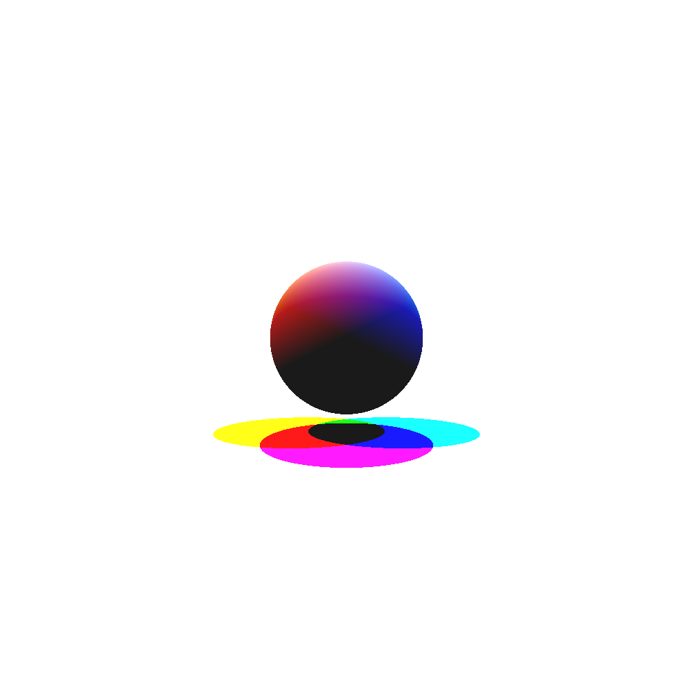

<h1>Ray Tracer with .NET Core</h1>

<table>
  <tr>
    <td></td>
    <td></td>
    <td></td>
  </tr>
</table>

<h2>How to compile and run</h2>
Install .NET SDK 
Run the command: 
<code>dotnet run &lt;JSON input file&gt; &lt;output file&gt; Program.cs</code>

<h2>Example input file</h2>
Feel free to change SceneParser.cs for different inputs. 
<code>{
	"perspectivecamera" : {
		"center" : [0, 0.5, 5],
		"direction" : [0, -0.1, -1],
		"up" : [0, 1, 0],
		"angle" : 30
	},
	"background" : {
		"color" : [0.2, 0.1, 0.6],
		"ambient" : [0.2, 0.2, 0.2]
	},
	"group" : [
		{ 
			"sphere" : {
				"center" : [0.3, 0.0, -1],
				"radius" : 1.0,
				"material" : 0
			}
		},
		{ 
			"sphere" : {
				"center" : [-0.5, -0.6, 0.2],
				"radius" : 0.4,
				"material" : 1
			}
		},
		{
			"plane" : {
				"normal" : [0.0, 1, 0.0],
				"offset" : -1,
				"material" : 2
			}
		}
	],
	"lights" : [
		{
			"directionalLight" : {
				"direction" : [0.5, -1, 0],
				"color" : [0.8, 0.8, 0.8]
			}
		}
	],
	"materials" : [
		{
			"phongMaterial" : {
				"diffuseColor" : [0.1, 0.1, 0.1],
				"specularColor" : [1, 1, 1],
				"exponent" : 50,
				"transparentColor" : [0, 0, 0],
				"reflectiveColor" : [0.9, 0.9, 0.9],
				"indexOfRefraction" : 1
			}
		},
		{
			"phongMaterial" : {
				"diffuseColor" : [1, 0.1, 0.1],
				"specularColor" : [1, 1, 1],
				"exponent" : 50,
				"transparentColor" : [0, 0, 0],
				"reflectiveColor" : [0.9, 0.1, 0.1],
				"indexOfRefraction" : 1
			}
		},
		{
			"phongMaterial" : {
				"diffuseColor" : [1, 1, 1]
			}
		}
	]
}
</code>
